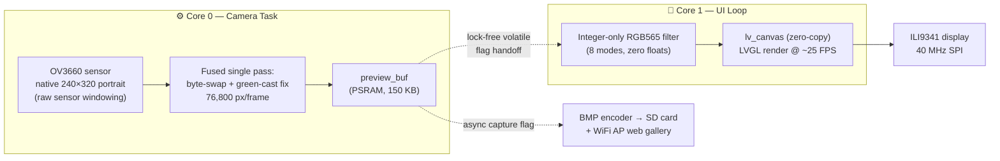
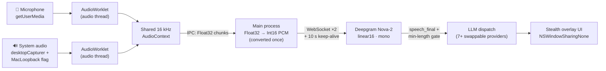

## 🧑‍💻 About Me

> *I'm an engineering student who builds **production-grade software across the entire stack** — from hand-tuned C++ firmware running on dual-core microcontrollers, to real-time AI desktop applications streaming audio over WebSockets, to full-stack web platforms that have served live events with 100+ concurrent users. I implement things from first principles: my TOTP authenticator is built from raw HMAC primitives (no crypto libraries) and **passes every official RFC 6238 test vector**, and my photo booth renders 25 FPS video with custom integer-only image filters on a chip with no GPU.*

- 🔭 Currently building **AI-powered desktop applications** with Electron, real-time audio pipelines, and vision LLMs
- ⚙️ Equally at home doing **register-level embedded work** — FreeRTOS task pinning, PSRAM buffer management, lock-free inter-core sync
- 🎓 Pursuing **B.Tech in CS & AI** at Jamia Hamdard University (2023–2027)
- 🛡️ **Management Head at HACKED BY JH** — I've run live CTF events and built the software they ran on
- 📍 Based in **Delhi, India** · Open to **internships** in backend, embedded, and AI/ML engineering

## 🧬 Engineering DNA

*Every skill below is backed by shipped code — click through and check.*

| Capability | Proven in | The receipt |
|---|---|---|
| **Embedded systems & RTOS** | [PhotoBooth ESP32-S3](https://github.com/ubairrr/PhotoBooth_ESP32-S3) | Dual-core FreeRTOS task pinning, lock-free producer/consumer sync, ~470 KB of hand-managed PSRAM frame buffers |
| **Real-time streaming systems** | [AI Desktop Overlay](https://github.com/ubairrr/interview-helper) | Two parallel 16 kHz PCM pipelines → Deepgram WebSockets, off-main-thread AudioWorklets, STT-driven utterance endpointing |
| **Applied cryptography** | [TOTP Generator](https://github.com/ubairrr/Ubair-s_TOTP_Gen) | RFC 4226/6238 implemented from raw `hmac`/`struct` primitives — validated against all official RFC 6238 Appendix B test vectors |
| **LLM integration & prompt engineering** | [AI Prompt Studio](https://github.com/ubairrr/Ubair-s-AI-Prompt-Generator) · [Overlay](https://github.com/ubairrr/interview-helper) | End-to-end SSE token streaming, provider-agnostic adapter across 7+ LLM backends, sentinel-delimited output contracts |
| **Full-stack web at event scale** | [HACKED Game](https://github.com/ubairrr/HACKED-GAME) | Next.js 15 + Prisma platform run live for 100+ participants; server-authoritative scoring, tiered polling architecture |
| **Low-level performance work** | [PhotoBooth ESP32-S3](https://github.com/ubairrr/PhotoBooth_ESP32-S3) | Integer-only RGB565 filters, bit-replication color expansion, linker-section tricks reclaiming ~150 KB of SRAM |
| **OS-level platform engineering** | [AI Desktop Overlay](https://github.com/ubairrr/interview-helper) | macOS screen-capture exclusion (`NSWindowSharingNone`), system-audio loopback workaround, click-through overlay windows |

## 🛠️ Tech Stack & Skills

### Languages

### Embedded & Systems

### Frontend, Desktop & Backend

### AI & Real-Time

### Infrastructure & Tools

# 🚀 Featured Projects

*Each project links to real, readable source. The deep-dive sections exist because the most interesting engineering rarely fits in a tagline.*

 

## 📸 PhotoBooth ESP32-S3 — A Camera OS on a Microcontroller

  

  
  
  
  

> **C++ · FreeRTOS · LVGL 8.3 · PlatformIO · ESPAsyncWebServer · JPEGDEC**

A complete standalone touchscreen photo booth running on a single ESP32-S3: **25 FPS live viewfinder**, 8 real-time image filters, an on-device photo gallery, and an **embedded WiFi web app** for downloading photos to your phone — all with no OS, no GPU, and a few hundred KB of usable RAM. ~4,000 lines of hand-written C++ across a layered HAL → core → UI architecture.

**How the two cores split the work:**

**🔥 Headline engineering:**
- **Dual-core, lock-free pipeline** — camera acquisition runs as a FreeRTOS task pinned to **Core 0** while LVGL UI + filter rendering own **Core 1**; the cores synchronize through volatile flag handoff (no mutexes, no queues) across a triple-buffered video path (~470 KB of `ps_malloc`'d PSRAM)
- **Zero-cost portrait video** — instead of rotating frames in software, the OV3660 sensor is **windowed at the raw-array level** (`set_res_raw`) to output native 240×320 portrait, and the copy pass **fuses big→little endian byte-swap with green-cast color correction** into a single loop over 76,800 pixels
- **8 real-time filters in pure integer math** — RGB565 grayscale via shift-weighted luma `(R·3 + G·4 + B) >> 3`, sepia as integer matrix mixes, vivid as fixed-point saturation/contrast (`×15/10`, `×12/10`), invert as a single bitwise NOT per pixel — no floats anywhere on the hot path
- **Hand-rolled BMP codec** — a from-scratch 24-bit BMP encoder (little-endian headers, 4-byte row padding, watchdog-safe `yield()` every 16 rows) plus **two decoders**, including a row-streamed 4× downsampling thumbnail decoder that never loads a full image into memory
- **An entire web service inside the firmware** — async HTTP server exposing 5 REST routes with real status-code semantics, serving a **self-contained ~5 KB dark-mode SPA from PROGMEM** (lazy-loaded grid, batch download/delete, glassmorphism — zero external dependencies), with **on-the-fly server-side BMP thumbnailing** and chunked file streaming from SD over a self-hosted WiFi AP + QR-code pairing
- **Boot animation engine** — a hand-written MJPEG container parser scans a 2 MB flash-resident video for JPEG SOI/EOI markers and decodes frames **in place from flash** via JPEGDEC at 15 FPS, before LVGL even initializes; assets produced by a custom `ffmpeg → Python → C-array` pipeline
- **Memory engineering** — all LVGL heap redirected into PSRAM, plus a GCC force-included header that re-sections large const assets into flash `.rodata`, **reclaiming ~150 KB of internal SRAM**

<b>🔬 Full technical deep dive</b>

 

**Hardware:** ESP32-S3 DevKitC-1 (16 MB flash, OPI PSRAM) · OV3660 3MP camera on an 8-bit DVP parallel bus (20 MHz XCLK via LEDC) · ILI9341 240×320 display on 40 MHz SPI · XPT2046 resistive touch (with a separate PlatformIO build environment that flashes an interactive touch calibrator) · MicroSD over 1-bit SDMMC (faster than SPI mode).

**Video path:** camera driver double-buffers in PSRAM (`CAMERA_GRAB_LATEST`), Core 0 writes a preview buffer, Core 1 applies the active filter while copying preview → an `lv_canvas`-bound buffer (zero-copy binding), and frame pacing is capped at 40 ms intervals → ~25 FPS with a live FPS counter. Capture is fully asynchronous: the UI raises a request flag, Core 0 freezes the next frame into a lazily-allocated capture buffer, and the preview screen fills in when it lands — the UI never blocks.

**ISP tuning in code:** white balance locked to "Sunny" to counter the OV3660's green bias under LED ring lights, AEC/AGC explicitly managed, vflip/hmirror for correct orientation.

**UI system:** 7 screens driven by a 9-state finite state machine, a create-then-destroy navigation lifecycle where every screen frees its PSRAM on exit, an 11-style shared theme with a 7-color palette, a custom-converted cursive display font, an animated floating mascot component built on `lv_anim` ping-pong, and a paginated gallery (12 thumbnails/page, newest-first by parsed filename ID). Two capture modes: raw sensor capture, or "Photobooth Style" which uses `lv_snapshot_take()` to bake the live feed + filter + UI chrome into the saved image (forcing `lv_refr_now` first so countdown overlays don't leak into the shot). `lv_conf.h` strips 15+ unused widgets to save flash.

**Web gallery details:** dynamic `/thumb/{n}` and `/photo/{n}` routing via an `onNotFound` prefix dispatcher; downloads stream via chunked responses with heap-allocated state objects that free themselves at EOF; deletes **tombstone** index slots so client-side photo IDs never drift mid-session; the radio is powered fully off except while sharing.

 

## 🕵️ Real-Time AI Desktop Overlay — Live STT + Vision LLMs on macOS

  

  
  
  
  

> **Electron 40 · React 19 · Vite 7 · Deepgram Nova-2 · OpenAI-compatible LLMs**

A transparent, always-on-top macOS overlay that **live-transcribes both sides of a conversation through two parallel speech-to-text pipelines**, streams answers from any LLM, and performs on-demand screenshot → vision-model analysis — while remaining invisible to screen-sharing apps. Built as an educational proof-of-concept in real-time systems and macOS platform engineering, with the ethics disclaimer front and center.

**The dual audio pipeline:**

**🔥 Headline engineering:**
- **Dual independent real-time audio pipelines** — microphone *and* system audio each run their own `AudioWorklet` on the audio rendering thread, share a single 16 kHz `AudioContext` (browser-level resampling, zero manual resample code), convert Float32 → Int16 PCM exactly once in the main process, and stream over **two separate Deepgram Nova-2 WebSockets** with readyState-guarded writes and 10-second keep-alives
- **Solved macOS's missing loopback audio** — macOS has no native `getUserMedia` system-audio capture, so the app combines `desktopCapturer` + `chromeMediaSource: 'desktop'` + Chromium's `MacLoopbackAudioForScreenShare` flag, then strips the mandatory video tracks to isolate a clean system-audio stream
- **STT-driven utterance endpointing** — instead of naive timers, a question-accumulation state machine buffers interim transcripts and dispatches to the LLM only on Deepgram's `speech_final` signal plus a minimum-length gate — the correct streaming-systems answer to "don't respond mid-sentence"
- **Provider-agnostic LLM adapter** — one OpenAI SDK client with runtime-resolved `baseURL`/`apiKey` hot-swaps across **7+ backends** (Gemini, NVIDIA NIM, OpenAI, Groq, OpenRouter, and fully local Ollama / LM Studio) with a vision-model fallback chain — zero code changes to switch providers
- **Four-layer stealth window** — `setContentProtection` (→ `NSWindowSharingNone`, excluded from Zoom/Meet/Teams capture buffers), screen-saver z-level, hidden Dock/Cmd-Tab presence, and visibility across all Spaces and fullscreen apps — plus a **click-through window with a hover-escape**: mouse events pass through the overlay by default and re-engage only when the cursor enters the drag bar
- **Measured 78.7% bundle reduction** — replaced `react-markdown` + `react-syntax-highlighter` with a ~25-line regex-based fenced-code renderer, cutting the production JS bundle from **950 kB → 203 kB** (322 kB → 64 kB gzipped) — reproducible from the repo
- **Security-correct Electron** — `contextIsolation` on, `nodeIntegration` off, and a preload bridge that **allowlists all 13 IPC channels by name**, so zero Node APIs leak into the renderer

<b>🔬 Full technical deep dive</b>

 

**Vision pipeline:** a global shortcut (works while any app has focus) grabs a 1920×1080 screen thumbnail via `desktopCapturer`, downscales it 50% with Electron's `nativeImage` to cut upload payload, and ships it as a multimodal chat completion. The UI immediately posts an inline screenshot preview plus an "analyzing…" placeholder before the API call resolves. Two purpose-built system prompts: a 6-rule spoken-answer persona for Q&A (length capped at "45–60 seconds spoken aloud", no filler openers), and a sub-100-word approach-plus-code prompt for vision. Vision round-trips dropped from ~25 s to ~10 s during development after the payload optimization.

**UX without ever clicking the window:** 8 global keyboard shortcuts cover capture, stealth/normal mode toggling, mic toggle, transcript scrolling, and font-size adjustment (clamped 8–20 px) — necessary because the overlay is mouse-transparent. The window self-resizes after every AI answer by measuring content `scrollHeight` and clamping to screen bounds.

**Failure UX done properly:** on a denied system-audio permission, the app deep-links the user directly to the exact macOS Screen Recording privacy pane (`x-apple.systempreferences:…Privacy_ScreenCapture`); Deepgram and LLM errors surface in-transcript over dedicated IPC channels; connection start/stop handlers are idempotent (existing sockets finished and keep-alive timers cleared before reconnecting); the app degrades gracefully to mic-only when loopback is unavailable.

**Process architecture:** classic three-part Electron — a 400-line main process owning audio sockets, LLM calls, shortcuts and window state; a sandboxed React 19 renderer; and a 54-line `contextBridge` preload. All renderer IPC listeners are registered in a single mount effect and torn down on unmount. Dev workflow runs Vite and Electron concurrently with `wait-on` gating launch; a clean production build completes in under a second.

 

## 🔐 TOTP Generator — RFC 6238 From Raw Primitives

  

  
  
  

> **Python · Flask 3 · raw `hmac` / `hashlib` / `struct` / `secrets` · Vanilla JS**

A fully RFC-compliant TOTP authenticator where **the entire cryptographic engine is implemented from scratch** — no `pyotp`, no OTP library of any kind. Every step of RFC 4226 (HOTP) and RFC 6238 (TOTP) is hand-built from Python stdlib primitives, and the implementation **passes all six official RFC 6238 Appendix B reference test vectors** across SHA-1, SHA-256, and SHA-512.

**🔥 Headline engineering:**
- **The RFC pipeline, by hand** — Base32 key decoding (with auto-repair of unpadded/lowercase real-world secrets), 8-byte big-endian counter packing via `struct.pack('>Q', …)`, HMAC digest, **RFC 4226 §5.3 dynamic truncation** (`offset = hash[-1] & 0x0F`), sign-bit masking (`& 0x7FFFFFFF`), and zero-padded modulo output that correctly preserves leading-zero codes — a classic bug in naive implementations, handled
- **Validated against the spec itself** — reproduces every RFC 6238 Appendix B test vector (e.g. T=59 / SHA-1 → `94287082`, SHA-512 → `90693936`)
- **Goes beyond standard authenticator apps** — configurable 6–10 digit codes, 1–300 s time steps, custom T0 epochs, three hash algorithms, and **clock-drift-tolerant verification** that checks a ±N-step window around the current counter
- **CSPRNG key generation** — secrets generated with `secrets.token_bytes` (not `random`), Base32-encoded, length-bounded 16–64 bytes
- **Clean REST API** — 4 endpoints with strict server-side validation and tiered error handling (`ValueError → 400`, generic → 500); `generate` returns the OTP *plus* live metadata (seconds-to-expiry, time-step counter, timestamp)
- **Dependency-free frontend** — 348 lines of vanilla JS with 1-second live auto-refresh, an **urgency-colored countdown bar** (gradient → amber under 40% → red under 20%), clipboard integration, animated verify pass/fail states, and a hand-written 556-line dark-theme CSS design system
- **Deployed live on Render** behind gunicorn — [try it](https://ubair-s-totp-gen-1.onrender.com) *(free tier, allow ~60 s cold start)*

 

## ✨ AI Prompt Studio — Streaming Meta-Prompt Engine

  

  
  
  

> **Flask 3 · Gemini 2.5 Flash (raw REST, no SDK) · Server-Sent Events · Vanilla JS**

A live web app that turns a rough idea into a **master-level, LLM-optimized prompt in a single pass** — replacing the usual 5–6 rounds of manual prompt iteration — with tokens streaming into the UI in real time. ~950 lines of code, zero frontend frameworks, deployed live.

**🔥 Headline engineering:**
- **End-to-end token streaming** — Gemini's SSE stream is consumed server-side, re-emitted as clean Server-Sent Events through a Flask streaming proxy, and parsed in the browser by a **hand-rolled SSE client** (`fetch` + `ReadableStream` reader + manual event-boundary buffering — built from scratch because `EventSource` can't POST)
- **The 4-D meta-prompting engine** — a system prompt that frames the model as a prompt-optimization specialist running *Deconstruct → Diagnose → Develop → Deliver*, including a **request-type → technique routing table** (creative → multi-perspective, technical → constraint-based, educational → few-shot, complex → chain-of-thought) and auto-detected BASIC/DETAIL operating modes
- **Deterministic LLM output via sentinel delimiters** — the optimized prompt must arrive wrapped in `<<<PROMPT>>> … <<<END>>>`, making free-form LLM output reliably machine-parseable and powering one-click "copy only the prompt"; the client parser even tolerates an **unclosed block so the prompt card renders progressively mid-stream**
- **Production-grade upstream resilience** — 5-attempt exponential backoff that distinguishes 429 rate limits (honoring `Retry-After` headers) from 5xx transients from connection failures, each separately logged; streaming errors delivered *in-band* as SSE events so the connection never just dies
- **Key hygiene** — the Gemini key lives server-side only (env + dotenv, hard `RuntimeError` if unset); every model call is proxied so the secret never touches the client
- **Hand-built brutalist design system** — CSS custom-property theming, hard offset shadows with a physical button "press" effect, progressive four-card rendering (prompt / improvements / techniques / pro-tip), `aria-live` streaming regions and full keyboard-focus treatment — all in vanilla HTML/CSS/JS

 

## 🎮 HACKED — Live Multiplayer Cybersecurity Game

  

  
  
  

> **Next.js 15 (App Router) · React 19 · TypeScript · Prisma 6 · SQLite · Tailwind v4**

A Matrix-themed "hack the firewall" gauntlet built for a live university club event: players race through five security-layer challenges (Caesar cipher, binary decoding, protocol trivia, a final riddle) while a **projected leaderboard updates live** and an organizer drives the whole event from an admin control panel. **Ran in production for 100+ participants with zero downtime.**

**🔥 Headline engineering:**
- **Server-authoritative game logic** — answers are validated and scored exclusively in API route handlers against a server-side answer key that **never ships to the client**; completion timestamps and elapsed times are computed server-side too, so the leaderboard can't be gamed from the browser
- **Multi-criteria live ranking** — three-level sort (completion status → points descending → fastest elapsed time as the tiebreak among finishers), recomputed on every leaderboard read
- **Pragmatic real-time under load** — tiered HTTP polling (admin 2 s / players 3 s / leaderboard 5 s) against an **in-memory game-state FSM** (`waiting → active → stopped`), so the highest-frequency requests cost zero database reads; SQLite handles the write-light workload (one row per registration, one update per solve)
- **Synchronized event orchestration** — an admin control plane (start / stop / full reset with data wipe) flips every connected client from an auto-updating waiting room into the live game simultaneously
- **Hand-coded Matrix rain** — a 96-line HTML5 Canvas renderer with per-column drop arrays, translucent-black trail persistence, per-glyph glow, resize handling and hydration-safe mounting — plus a full terminal/CRT design system (typewriter boot sequence, glitch keyframes, scan-line overlays, medal-tinted responsive leaderboard)
- **Honest architecture awareness** — the in-memory FSM deliberately assumes a single Node process, a constraint chosen (and understood) for a LAN-deployed one-night event — the kind of tradeoff reasoning that matters more than the stack

## 📐 By the Numbers

| | |
|---|---|
| 🧮 **~9,500+ lines** | of hand-written code across featured projects — C++, Python, TypeScript, JavaScript |
| 🌐 **2 apps live in production** | [TOTP Generator](https://ubair-s-totp-gen-1.onrender.com) · [AI Prompt Studio](https://ubair-s-ai-prompt-generator.onrender.com) |
| ✅ **6 / 6 RFC test vectors** | official RFC 6238 Appendix B reference vectors passed by from-scratch crypto |
| 🎞️ **25 FPS** | filtered live video on a microcontroller with no GPU |
| 📉 **78.7% bundle cut** | 950 kB → 203 kB by replacing two libraries with 25 lines of code |
| 👥 **100+ concurrent players** | served live at a university event, zero downtime |
| 🔌 **7+ LLM providers** | hot-swappable through one OpenAI-compatible adapter |

## 📊 GitHub Analytics

  
  

  

 

---

## 🏆 GitHub Trophies

  

## 💼 Professional Highlights

<table>
<tr>
<td width="50%">

### 🎓 Education
**B.Tech — Computer Science & Artificial Intelligence**
Jamia Hamdard University · 2023–2027
CGPA: **7.5** (Currently Pursuing)

### 📜 Certifications
- 🏅 **Data Science & Analytics** — HP Life (2024)
- ☁️ **Introduction to Cloud 101** — AWS Educate (2025)
- ☁️ **AWS Management Console** — AWS Educate (2025)

</td>
<td width="50%">

### 🏢 Leadership Experience
**Management Head** — HACKED BY JH
*2023 – Present*
- Owned **end-to-end technical delivery** of multiple CTF events and workshops over 2 years — from deployment to live incident response
- Built the event software myself ([HACKED Game](https://github.com/ubairrr/HACKED-GAME)) *and* ran it live for **100+ participants per event with zero downtime**
- Led cross-functional organizing teams across development, logistics & communications

</td>
</tr>
</table>

## 🐍 Contribution Snake

  <picture>
    <source media="(prefers-color-scheme: dark)" srcset="https://raw.githubusercontent.com/ubairrr/ubairrr/output/github-snake-dark.svg" />
    <source media="(prefers-color-scheme: light)" srcset="https://raw.githubusercontent.com/ubairrr/ubairrr/output/github-snake.svg" />
    
  </picture>

## 📫 Let's Connect

| Platform | Link |
|:--------:|:----:|
| 📧 **Email** | [mustafaubair@gmail.com](https://mail.google.com/mail/?view=cm&to=mustafaubair@gmail.com) |
| 💼 **LinkedIn** | [linkedin.com/in/mustafaubair](https://linkedin.com/in/mustafaubair) |
| 🐙 **GitHub** | [github.com/ubairrr](https://github.com/ubairrr) |
| 📍 **Location** | Delhi, India |

---

### 💬 Open to Opportunities

*I'm actively seeking **internship opportunities** in backend engineering, embedded systems, and AI/ML integration.*
*Everything claimed above is verifiable in the code — and if you're building something ambitious, let's talk.*

**📩 Reach out at [mustafaubair@gmail.com](https://mail.google.com/mail/?view=cm&to=mustafaubair@gmail.com) or connect on [LinkedIn](https://linkedin.com/in/mustafaubair)**

---

*⭐ If you find my projects interesting, consider giving them a star — it helps a lot!*

